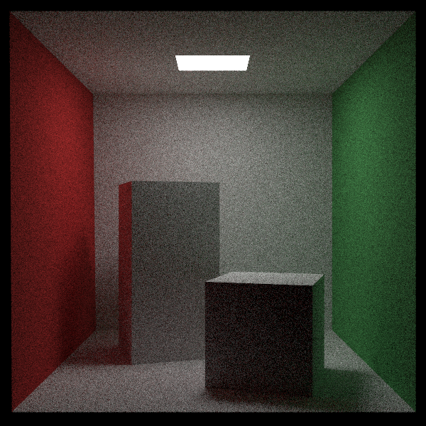
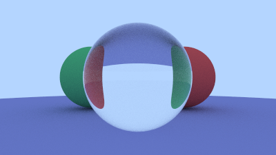

# Raytracer

A basic raytracer supporting diffuse, metal, and dielectric materials, textures, and Phong shading.

## Features

- Materials
    - Diffuse
    - Metal
    - Dielectric
    - Phong
- Textures
    - Image textures
    - Perlin noise textures
    - Normal maps
- Import camera and objects from a file using Assimp (works best with .gltf files)
- Bounding volume hierarchy
- Multithreading

# Example Renders


Random sphere scene from [Ray Tracing in One Weekend](https://raytracing.github.io/books/RayTracingInOneWeekend.html)



Cornell box with 600 samples per pixel


Imported [owl model](https://sketchfab.com/3d-models/owl-zun-wine-vessel-13th-12th-century-bce-ca77ae1351ca4b1c9a7d403e09e1c4af)



Dielectric and diffuse materials

# Build Instructions

## Requires
- CMake 3.16.0
- C++17
- [Assimp](https://github.com/assimp/assimp)
    - [Build/Install Instructions](https://github.com/assimp/assimp/blob/master/Build.md)
- Boost Test (Set CMake option `RT_BUILD_TESTS` to `OFF` to disable testing)

## Build
```
git clone https://github.com/mujpao/Raytracer.git
cd Raytracer
mkdir build
cd build
cmake ..
cmake --build .
```

# Usage
See [examples](examples) folder.

# TODO
- [ ] Support different image formats
- [ ] Physically-based materials/lights
- [ ] Read lights from file
- [ ] Environment maps

# Resources
- [Ray Tracing in One Weekend Series](https://raytracing.github.io/)
- [edX Computer Graphics Course](https://www.edx.org/course/computer-graphics-2)
- [stb image libraries](https://github.com/nothings/stb)
- [Scratchapixel](https://www.scratchapixel.com/)
- [Assimp](https://github.com/assimp/assimp)
- [Learn OpenGL](https://learnopengl.com/)
